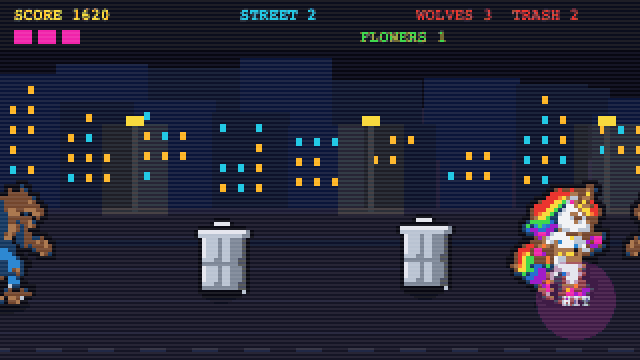

# Rainbow Fight

A beat-em-up for js13kGames 2026 (theme: Unicorns and Rainbows). A unicorn cleans
the city: it punches wolves and turns trash cans into flowers with a rainbow beam
fired from its horn.



Everything fits in one HTML file: no framework, no image, no external sound. The
sprites are RLE-encoded in the source and the music is generated with the Web
Audio API. The contest archive is 13,312 bytes at most; the measured size of the
ZIP is printed by every build and changes from one build to the next.

## Controls

Move with the arrows, WASD or ZQSD, or with the virtual stick that appears under
your finger on the left half of the screen. Hit with space, J, K, X or the pad in
the bottom right corner. M mutes the music, R restarts.

- Three hits in a row make a smash with a big knockback.
- Holding the hit button charges the rainbow beam. Released at full charge, it
  crosses the street, hurts every wolf in its path and makes the trash cans bloom.
- Wolves pick up trash cans and throw them. A wolf carrying a can does not lose a
  hit point: the blow only knocks its burden loose.
- A thrown can can be volleyed back with a well-timed hit.
- To move on to the next street: no wolf standing and every can in bloom.
- Each street adds a wolf, a can, 5 % of wolf speed and 3 BPM to the music.

Street 1 is a tutorial the first time you play in a session. After a death it is
played normally.

## Build

Requirements: Node.js 20 or later (see `.nvmrc`) and npm. Install `advzip`
(`brew install advancecomp` on macOS) to get the final compression used for the
submitted archive; without it the build keeps the zlib archive, a few percent
bigger.

```bash
npm ci
npm run build
```

One command produces the three deliverables from the same snapshot of the source:

```text
rainbow-fight.zip            # contest archive, at the repository root
dist/js13k/index.html        # the exact page stored in the ZIP, packed with Roadroller
dist/wavedash/index.html     # the source as is, for the Wavedash platform
```

`dist/` and the ZIP are generated and ignored by Git; they are replaced only when
the new archive fits the budget, so a failed build never destroys a valid one.

### What the build does

`tools/build.mjs` extracts the `<script>` and the `<style>` from `src/index.html`,
minifies the script with terser (three passes, `unsafe`, top-level mangling),
packs it with Roadroller, rebuilds a minimal HTML page around a single
`<canvas id=c>`, and writes the archive with node's zlib before handing it to
advzip. The viewport tag is kept, otherwise phones render the page in a 980 px
virtual viewport.

Roadroller's parameter search is random, so the same source gives archives that
differ by a few bytes from one run to the next. The build therefore packs the
source several times and keeps the smallest archive: `npm run build` makes three
draws, `npm run build:max` six draws with `-O2`. `npm run build:fast` skips
Roadroller and writes `.build/fast/index.html` only; it never touches the
deliverables, so a quick build cannot overwrite the archive with an oversized one.

Terser is not allowed to rewrite booleans as integers: the Wavedash SDK validates
the types of its arguments and would silently reject a `1` where it expects `true`.

Consequence of the rebuilt page: the source must not depend on any DOM element
other than the canvas `#c`.

### Checks

```bash
npm test             # syntax check, then the Wavedash integration test
npm run preview      # serves dist/js13k on http://localhost:8013
```

## Wavedash

The game also targets the Wavedash challenge. The platform injects its SDK before
the page's own script, so the game never downloads anything: every call is made
only when the global exists, behind its own guard, and the game behaves
identically everywhere else.

The integration has ten trophies and one leaderboard, `high-score`, sent at game
over. The definitions live in [achievements.json](wavedash/achievements.json) and
[leaderboards.json](wavedash/leaderboards.json). A trophy also shows a banner
drawn by the game itself, so it is visible on js13kgames.com too; several
trophies earned in the same second queue up, two seconds each.

Trophies wait for `requestStats()` to answer before being sent, because the SDK
ignores `setAchievement()` until then, and they are only sent once per session.
`npm run test:wavedash` runs the game against a strict fake SDK that validates
argument types and counts calls, on the source and on the terser output the
build ships, with missing, throwing and rejecting methods. It replaces nothing:
only a run inside `wavedash dev` proves the round trip to the platform.

[wavedash.toml](wavedash.toml) holds the game identifier and points the upload at
`dist/wavedash`, the unminified copy of the source. The `wavedash/` folder also
holds the trailer for the store page.

## Submission media

- `media/cover.png`: 800 x 500 PNG cover.
- `media/thumbnail.png`: 320 x 320 PNG adapted from the cover.
- `media/gameplay.gif`: gameplay preview used above.
- `media/screenshots/`: five game screenshots.
- `wavedash/trailer.mp4`: 12 seconds of gameplay, H.264, 1280 x 720, 25 fps,
  without audio.

Build outputs, prototypes, capture/calibration tools and local reports are ignored
by Git. The repository keeps the readable source, build and preview tools,
Wavedash integration tests, platform definitions and submission media.

## Technical notes

- 16-colour palette, 32x32 sprites encoded in 4-bit RLE then base64.
- The passing frame of the walk cycle and the arms-up wolf are generated at load
  time from the other frames, which is cheaper than storing them.
- Four-voice NES-style music on the AudioContext clock: two chord grids, four
  lead lines, three drum patterns, five keys, drawn at random on every street.
- Audio is entirely optional. Without an AudioContext the game runs the same.
- The local leaderboard lives in `localStorage` under the key `rf13`, as
  `NAME<score>,NAME<score>,...`. Reads and writes are wrapped in `try/catch`: in a
  sandboxed iframe the access throws and the game keeps an in-memory board.

## License

MIT.
